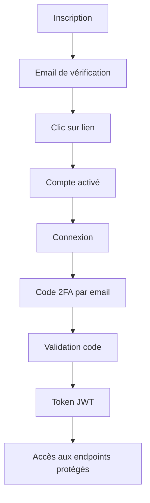

# 🎬 Movie Watchlist API

<div align="center">


**Une API NestJS moderne et sécurisée pour gérer votre collection de films**

[Démonstration](#-démonstration) • [Installation](#-installation) • [API Documentation](#-documentation-api) • [Tests](#-tests)

</div>

---

## 📖 Description

Movie Watchlist est une API REST complète développée avec NestJS qui permet aux utilisateurs de créer et gérer leur liste personnelle de films. L'application implémente un système d'authentification robuste avec vérification par email et authentification à deux facteurs (2FA).

### ✨ Fonctionnalités principales

- 🔐 **Authentification sécurisée** avec JWT et 2FA par email
- 📧 **Vérification d'email** obligatoire à l'inscription
- 👥 **Gestion des rôles** (Utilisateur / Administrateur)
- 🎭 **Isolation des données** - chaque utilisateur accède uniquement à ses films
- 📊 **Statistiques personnalisées** de votre watchlist
- 🔍 **Endpoints publics et privés** avec protection par guards
- 📚 **Documentation Swagger** interactive complète
- ✅ **Validation robuste** avec DTOs et class-validator

---

## 🚀 Démonstration

### Workflow utilisateur type

1. **Inscription** → Réception d'un email de vérification
2. **Vérification email** → Activation du compte via lien cliquable
3. **Connexion** → Envoi automatique d'un code 2FA par email
4. **Validation 2FA** → Accès à l'API avec token JWT
5. **Gestion des films** → CRUD complet de votre watchlist personnelle

### Sécurité et isolation

- 🔒 **Utilisateur standard** : Accès uniquement à ses propres films
- 👑 **Administrateur** : Accès à tous les films de tous les utilisateurs
- 🛡️ **Protection complète** : Tous les endpoints sensibles protégés par JWT
- 🚫 **Isolation garantie** : Impossible d'accéder aux données d'autres utilisateurs

---

## 📋 Prérequis

Avant de commencer, assurez-vous d'avoir installé :

- **Node.js** (version 16 ou supérieure)
- **PostgreSQL** (version 12 ou supérieure)
- **npm** ou **yarn**
- **Compte Gmail** avec mot de passe d'application configuré

---

## ⚙️ Installation

### 1. 📥 Cloner le projet

```bash
git clone <votre-repository>
cd movie-watchlist
```

### 2. 📦 Installer les dépendances

```bash
npm install
```

### 3. 🗄️ Configuration de la base de données

Créez une base de données PostgreSQL :

```sql
CREATE DATABASE movie_watchlist;
```

### 4. 🔧 Configuration des variables d'environnement

Créez un fichier `.env` à la racine du projet :

```env
# 🗄️ Configuration Base de données
DATABASE_HOST=localhost
DATABASE_PORT=5432
DATABASE_USERNAME=postgres
DATABASE_PASSWORD=votre_mot_de_passe
DATABASE_NAME=movie_watchlist

# 🔐 Configuration JWT
JWT_SECRET=votre-clé-secrète-très-sécurisée-ici
JWT_EXPIRATION_TIME=3600

# 📧 Configuration Email (Gmail)
MAIL_HOST=smtp.gmail.com
MAIL_PORT=587
MAIL_USER=votre-email@gmail.com
MAIL_PASSWORD=votre-mot-de-passe-application
MAIL_FROM=votre-email@gmail.com

# 🌐 Configuration Application
PORT=3000
```

> ⚠️ **Important** : Pour Gmail, utilisez un [mot de passe d'application](https://support.google.com/accounts/answer/185833) et activez la 2FA sur votre compte.

### 5. 🚀 Démarrer l'application

```bash
# Mode développement avec hot-reload
npm run start:dev

# Mode production
npm run start:prod
```

L'API sera accessible sur : **http://localhost:3000**

---

## 📚 Documentation API

### 🌐 Swagger UI

Une fois l'application démarrée, accédez à la documentation interactive :

**➡️ http://localhost:3000/api**

La documentation Swagger vous permet de :
- 📖 Consulter tous les endpoints disponibles
- 🧪 Tester directement les APIs depuis l'interface
- 🔐 Configurer l'authentification Bearer token
- 📋 Voir les schémas de données et validations

### 🗂️ Endpoints principaux

| Méthode | Endpoint | Description | Protection |
|---------|----------|-------------|------------|
| `POST` | `/auth/register` | Inscription utilisateur | Public |
| `GET` | `/auth/verify-email` | Vérification email | Public |
| `POST` | `/auth/login` | Connexion (envoi 2FA) | Public |
| `POST` | `/auth/verify-2fa` | Validation code 2FA | Public |
| `GET` | `/health` | État de l'API | Public |
| `GET` | `/movies` | Liste des films | 🔒 JWT |
| `POST` | `/movies` | Ajouter un film | 🔒 JWT |
| `GET` | `/movies/statistics` | Statistiques watchlist | 🔒 JWT |
| `PATCH` | `/movies/:id/watch` | Marquer comme vu | 🔒 JWT |
| `GET` | `/movies/admin/all-users-movies` | Tous les films | 🔒 Admin |

---

## 🧪 Tests

### 🚀 Démarrage des tests

```bash
npm run start:dev
```

Attendez le message de confirmation :
```
[Nest] LOG [NestApplication] Nest application successfully started
```

### 📋 Guide de test complet

#### 1. 🆔 Test d'inscription

```powershell
Invoke-RestMethod -Uri "http://localhost:3000/auth/register" -Method POST -Headers @{"Content-Type"="application/json"} -Body '{"email": "test@example.com", "name": "John Doe", "password": "password123"}'
```

**✅ Résultat attendu :**
```json
{
  "message": "User registered successfully. Please check your email for verification.",
  "userId": "550e8400-e29b-41d4-a716-446655440000"
}
```

#### 2. 📧 Vérification email

1. **Consultez votre boîte email**
2. **Cliquez sur le lien de vérification**
3. **Confirmez** que vous voyez la page de succès

#### 3. 🔐 Test de connexion + 2FA

```powershell
# Étape 1 : Connexion
$loginResponse = Invoke-RestMethod -Uri "http://localhost:3000/auth/login" -Method POST -Headers @{"Content-Type"="application/json"} -Body '{"email": "test@example.com", "password": "password123"}'

# Étape 2 : Récupérer le code 2FA dans votre email
# Étape 3 : Valider le code 2FA
$authResponse = Invoke-RestMethod -Uri "http://localhost:3000/auth/verify-2fa" -Method POST -Headers @{"Content-Type"="application/json"} -Body '{"code": "123456", "token": "TEMP_TOKEN_REÇU"}'
```

**✅ Résultat final attendu :**
```json
{
  "access_token": "eyJhbGciOiJIUzI1NiIsInR5cCI6IkpXVCJ9...",
  "user": {
    "id": "550e8400-e29b-41d4-a716-446655440000",
    "email": "test@example.com",
    "name": "John Doe",
    "role": "user"
  }
}
```

#### 4. 🔒 Test de protection des endpoints

```powershell
# ❌ Sans token - Doit échouer (401)
Invoke-RestMethod -Uri "http://localhost:3000/movies" -Method GET

# ✅ Avec token - Doit fonctionner
$headers = @{"Authorization" = "Bearer VOTRE_ACCESS_TOKEN"}
Invoke-RestMethod -Uri "http://localhost:3000/movies" -Method GET -Headers $headers
```

#### 5. 🎬 Test CRUD des films

```powershell
$headers = @{"Content-Type" = "application/json"; "Authorization" = "Bearer VOTRE_TOKEN"}

# Ajouter des films
$matrix = '{"title": "The Matrix", "description": "Neo découvre la vérité sur la réalité", "genre": "Science-Fiction", "director": "Wachowski Sisters", "releaseYear": 1999, "rating": 8.7}'
$inception = '{"title": "Inception", "description": "Plongée dans les rêves", "genre": "Science-Fiction", "director": "Christopher Nolan", "releaseYear": 2010, "rating": 8.8}'

$movie1 = Invoke-RestMethod -Uri "http://localhost:3000/movies" -Method POST -Headers $headers -Body $matrix
$movie2 = Invoke-RestMethod -Uri "http://localhost:3000/movies" -Method POST -Headers $headers -Body $inception

# Marquer comme regardé
$watchBody = '{"review": "Chef-d'\''œuvre absolu du cinéma !"}'
Invoke-RestMethod -Uri "http://localhost:3000/movies/$($movie1.id)/watch" -Method PATCH -Headers $headers -Body $watchBody

# Consulter les statistiques
Invoke-RestMethod -Uri "http://localhost:3000/movies/statistics" -Method GET -Headers $headers
```

#### 6. 👥 Test d'isolation utilisateurs

```powershell
# Créer un second utilisateur
Invoke-RestMethod -Uri "http://localhost:3000/auth/register" -Method POST -Headers @{"Content-Type"="application/json"} -Body '{"email": "user2@test.com", "name": "Jane Doe", "password": "password123"}'

# Répéter le processus de vérification + connexion + 2FA

# Vérifier l'isolation
$headersUser1 = @{"Authorization" = "Bearer TOKEN_USER1"}
$headersUser2 = @{"Authorization" = "Bearer TOKEN_USER2"}

$filmsUser1 = Invoke-RestMethod -Uri "http://localhost:3000/movies" -Method GET -Headers $headersUser1
$filmsUser2 = Invoke-RestMethod -Uri "http://localhost:3000/movies" -Method GET -Headers $headersUser2

# User1 voit ses films, User2 voit une liste vide
```

#### 7. 👑 Test des privilèges administrateur

```sql
-- Dans PostgreSQL, promouvoir un utilisateur en admin
UPDATE users SET role = 'admin' WHERE email = 'test@example.com';
```

```powershell
# Se reconnecter pour obtenir un token avec le nouveau rôle
# Tester l'accès admin
$adminHeaders = @{"Authorization" = "Bearer NOUVEAU_TOKEN_ADMIN"}
Invoke-RestMethod -Uri "http://localhost:3000/movies/admin/all-users-movies" -Method GET -Headers $adminHeaders
```

---

## 🏗️ Architecture

### 📁 Structure du projet

```
src/
├── 🔐 auth/                    # Module d'authentification
│   ├── dto/                   # DTOs (Register, Login, Verify2FA)
│   ├── guards/                # Guards JWT et Roles
│   ├── strategies/            # Stratégie JWT Passport
│   ├── auth.controller.ts     # Endpoints d'authentification
│   ├── auth.service.ts        # Logique métier auth
│   └── auth.module.ts         # Configuration du module
│
├── 👥 users/                  # Module utilisateurs
│   ├── dto/                   # DTOs utilisateur
│   ├── entities/              # Entité User (TypeORM)
│   ├── users.service.ts       # CRUD utilisateurs
│   └── users.module.ts        # Configuration du module
│
├── 📧 email/                  # Module email
│   ├── email.service.ts       # Service d'envoi d'emails
│   ├── email.controller.ts    # Endpoints de test
│   └── email.module.ts        # Configuration Nodemailer
│
├── 🎬 movies/                 # Module films
│   ├── dto/                   # DTOs films
│   ├── entities/              # Entité Movie (TypeORM)
│   ├── movies.service.ts      # Logique métier films
│   ├── movies.controller.ts   # CRUD + endpoints admin
│   └── movies.module.ts       # Configuration du module
│
├── 🛠️ common/                # Éléments partagés
│   ├── decorators/            # @Roles, @GetUser
│   ├── enums/                 # Role enum
│   └── guards/                # Guards réutilisables
│
├── 📋 main.ts                 # Point d'entrée + config Swagger
└── 📦 app.module.ts           # Module racine
```

### 🔄 Flux d'authentification



---

## 🛡️ Sécurité

### 🔐 Mesures de sécurité implémentées

- **🔑 Hachage des mots de passe** avec bcryptjs
- **📧 Vérification email obligatoire** avant activation
- **🔢 Authentification 2FA** par email avec codes temporaires
- **🎫 Tokens JWT** avec expiration configurable
- **🛡️ Guards de protection** sur tous les endpoints sensibles
- **👥 Isolation stricte** des données par utilisateur
- **🔍 Validation robuste** des entrées avec class-validator
- **🚫 Protection CORS** et headers de sécurité

### 👥 Gestion des rôles

| Rôle | Permissions |
|------|-------------|
| **User** | Accès CRUD à ses propres films uniquement |
| **Admin** | Accès à tous les films + endpoints d'administration |

---

## 🛠️ Technologies utilisées

| Catégorie | Technologies |
|-----------|--------------|
| **Framework** |  |
| **Langage** |  |
| **Base de données** |  |
| **ORM** |  |
| **Authentification** |   |
| **Email** |  |
| **Documentation** |  |
| **Validation** |  |

---

## 📊 Fonctionnalités avancées

### 📈 Statistiques personnelles

L'API fournit des statistiques détaillées pour chaque utilisateur :

```json
{
  "totalMovies": 25,
  "watchedMovies": 15,
  "unwatchedMovies": 10,
  "averageRating": "8.2"
}
```

### 🏷️ Système de tags et genres

- Classification par genres
- Système de notation (0-10)
- Avis personnalisés
- Date de visionnage

### 🔍 Endpoints d'administration

Les administrateurs disposent d'endpoints spéciaux :
- Vue globale de tous les films
- Statistiques générales de la plateforme
- Gestion avancée des utilisateurs

---

## 🐛 Dépannage

### ❌ Problèmes courants

#### Base de données non accessible
```bash
# Vérifiez que PostgreSQL est démarré
sudo service postgresql start

# Vérifiez la connexion
psql -h localhost -U postgres -d movie_watchlist
```

#### Emails non reçus
1. Vérifiez votre configuration Gmail dans `.env`
2. Utilisez un mot de passe d'application Gmail
3. Activez la 2FA sur votre compte Gmail
4. Vérifiez les spams

#### Erreur JWT
```env
# Assurez-vous que JWT_SECRET est défini et suffisamment long
JWT_SECRET=votre-clé-très-longue-et-sécurisée-ici-au-moins-32-caractères
```

### 🔍 Logs et debugging

```bash
# Voir les logs en temps réel
npm run start:dev

# Activer les logs de debugging
DEBUG=* npm run start:dev
```

---

## 🤝 Contribution

### 📝 Guidelines

1. **Fork** le projet
2. **Créer** une branche feature (`git checkout -b feature/nouvelle-fonctionnalite`)
3. **Commit** vos changements (`git commit -m 'Ajout: nouvelle fonctionnalité'`)
4. **Push** vers la branche (`git push origin feature/nouvelle-fonctionnalite`)
5. **Ouvrir** une Pull Request

### 🧪 Tests requis

```bash
# Tests unitaires
npm run test

# Tests e2e
npm run test:e2e

# Coverage
npm run test:cov
```

---

## 📄 Licence

Ce projet est sous licence **MIT**. Voir le fichier [LICENSE](LICENSE) pour plus de détails.

---

## 👨‍💻 Auteur

**Développé avec ❤️ par l'équipe Movie Watchlist**

---

## 🙏 Remerciements

- [NestJS](https://nestjs.com/) pour le framework extraordinaire
- [TypeORM](https://typeorm.io/) pour l'ORM robuste
- [Swagger](https://swagger.io/) pour la documentation interactive
- La communauté open source pour l'inspiration

---

<div align="center">

**⭐ Si ce projet vous a aidé, n'hésitez pas à lui donner une étoile ! ⭐**